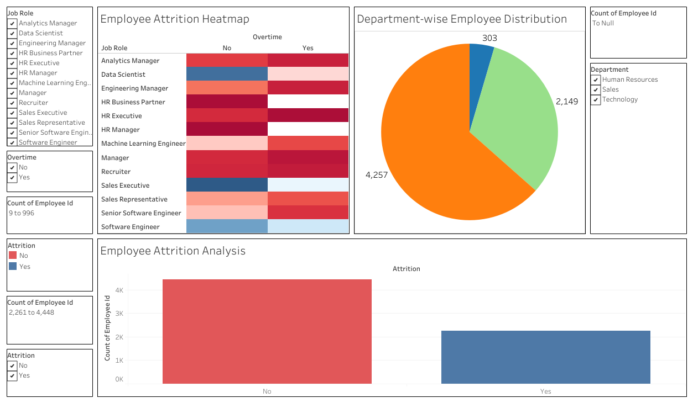

# 📊 HR Dataset Analysis

## 📌 Project Overview
This project focuses on analyzing an HR dataset to gain insights into employee trends, performance, and attrition. The dataset is cleaned, processed, analyzed, and visualized to help decision-makers make data-driven decisions.

## 📂 Dataset Description
The dataset contains information on employees, including:
- **👤 Personal Information**: Age, Gender, Marital Status
- **🏢 Employment Details**: Hire Date, Department, Job Role, Business Travel
- **💰 Compensation & Tenure**: Salary, Years at Company, Years in Current Role
- **📈 Performance Metrics**: Job Satisfaction, Performance Rating
- **🚀 Attrition Factors**: Work-Life Balance, Distance from Home, OverTime

## 📅 Project Phases
### **🛠️ Week 1: Data Cleaning & Preprocessing**
- ✅ Convert date columns to datetime format.
- ✅ Handle missing values and outliers.
- ✅ Standardize categorical data.
- ✅ Save the cleaned dataset for further analysis.

### **🔍 Week 2: Analysis Questions Phase**
- Identify key questions such as:
  - 📊 What is the relationship between employees' ages and their satisfaction levels?
  - 🏠 How does the distance from home affect attrition rates?
  - 👩‍💼 What is the gender distribution across departments?
- Define analysis questions that help gain insights from the dataset.

### **📈 Week 3: Forecasting Questions Phase**
- Identify forecasting trends using the dataset.
- Example questions:
  - 📉 What is the predicted attrition rate based on current trends?
  - 💵 How will salary levels evolve over the next 5 years?
  - 🏢 Which departments are likely to see the most employee growth?
- Implement forecasting models using Python (scikit-learn, pandas, Matplotlib).

### **📊 Week 4: Visualization Dashboard & Final Report**
- 🎨 Create visualizations to answer analysis and forecasting questions.
- Example charts:
  - 📊 Bar chart for salary distribution by department.
  - 📉 Attrition rates based on overtime.
  - 📈 Employee count trends over time by department.
- 🖥️ Build a Tableau dashboard or use Matplotlib/Seaborn for visualizations.
- 📝 Prepare a final report summarizing findings and insights.


## 🛠️ Tools & Technologies
- 🐍 **Python** (pandas, numpy, matplotlib, scikit-learn)
- 🗄️ **SQL** for data querying and transformation
- 📊 **Tableau** for interactive visualizations
- 📓 **Jupyter Notebook** for analysis and modeling

## 🚀 How to Use
1. Clone this repository:  
   ```bash
   git clone https://github.com/MohamedElmogy25/Human-Resources-Dataset-Analysis.git
   ```
2. Install required dependencies:  
   ```bash
   pip install pandas numpy matplotlib scikit-learn
   ```
3. Run the data preprocessing script:  
   ```bash
   python data_preprocessing.ipynb
   ```
4. Explore analysis and forecasting notebooks.
5. View visualizations in Tableau or Matplotlib.

## 👥 Contributors
- **Mohamed Elmogy** - 🛠️ Data Cleaning & Preprocessing
- **Nourhan Farag** - 📊 Analysis & Forecasting
- **Doha Mostafa** - 🎨 Visualization & Reporting
- **Abdelrahman Yasser** - 📈 Forecasting & Trends Analysis
- **Seham Mostafa** - 📂 Data Management & Processing
- **Bassant Yasser** - 📊 Dashboard & Report Creation

## 📜 License
This project is open-source and available under the MIT License.

